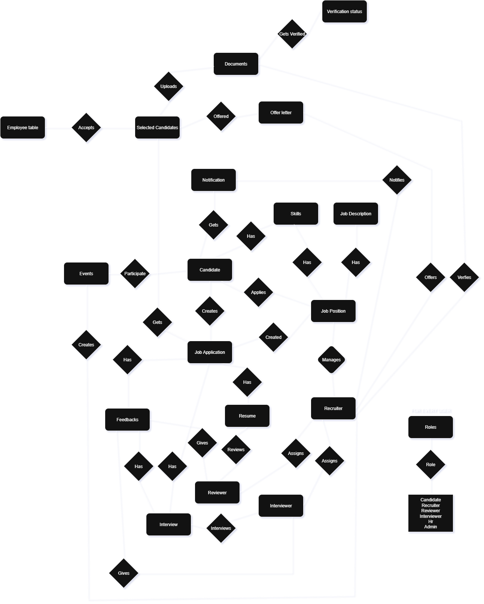

---

# Recruitment Process Management System



---

## Technology Stack

- **Framework:** .NET 8 (ASP.NET Core)
- **Language:** C\#
- **Database:** Microsoft SQL Server
- **ORM:** Entity Framework Core
- **Authentication:** JWT Bearer (via `Microsoft.AspNetCore.Authentication.JwtBearer`)
- **API Documentation:** Swagger/OpenAPI (via `Swashbuckle.AspNetCore` and `Scalar.AspNetCore`)

---

## Setup and Configuration

### 1\. Prerequisites

- .NET 8 SDK

### 2\. Database Configuration

Update the connection string in your `appsettings.json` (or environment variables) to point to your SQL Server instance.

**`appsettings.json` snippet:**

```json
"ConnectionStrings": {
  "AppDatabase": "Server=localhost,5050;Database=RPMSDatabase;User Id=sa;Password=Passw0rd123;MultipleActiveResultSets=True;TrustServerCertificate=True;"
}
```

### 3\. Running Migrations

After configuring the connection string, run the following commands t`o create the database schema:

```bash
# 1. using Microsoft.EntityFrameworkCore.Tools
update-database
```

The application will typically start on `https://localhost:7081`.

For scalar[Interactive Api] use `https://localhost:7081/scalar/`

---
